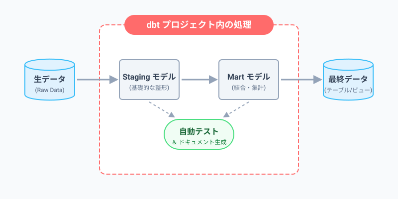
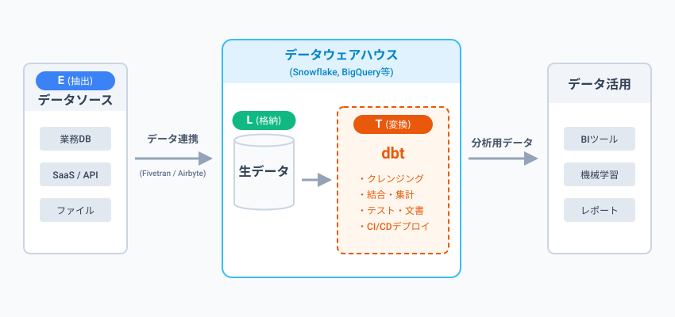
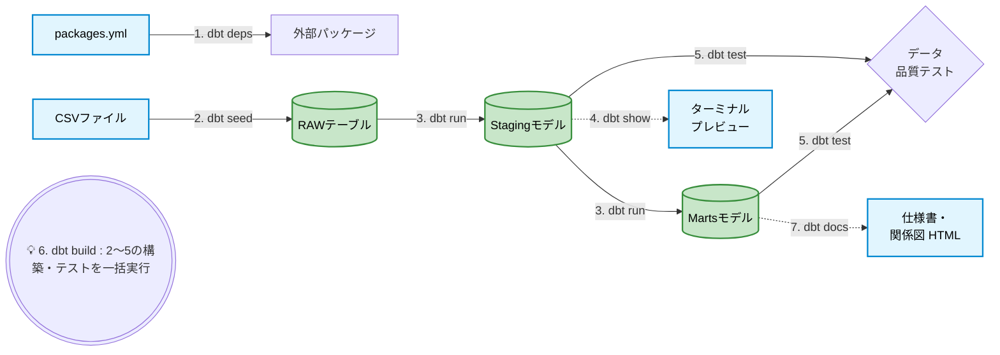
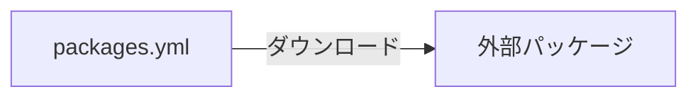
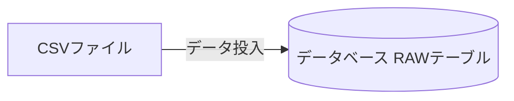
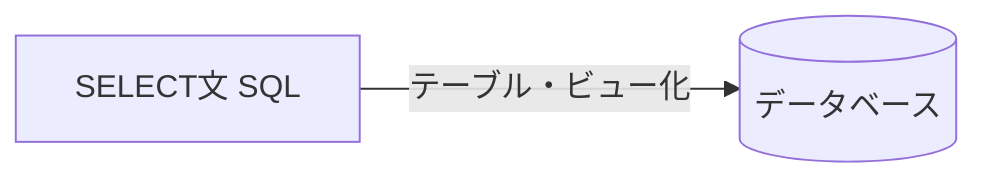
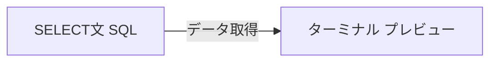
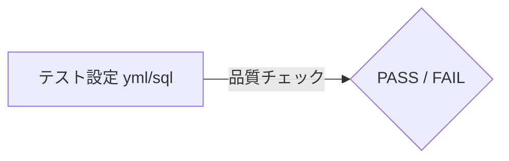
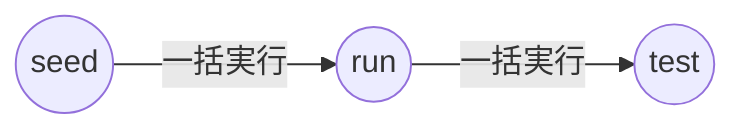
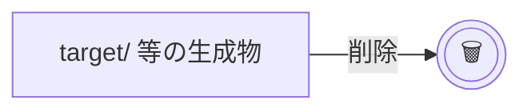

# dbt 学習用サンプルプロジェクト

このプロジェクトは、dbt（data build tool）の基本的な概念と使い方を学習するためのサンプルです。
実務で頻繁に使われる機能を最小限のコードで体験できるようになっています。

## ディレクトリ構成と解説

### 1. `models/staging/`
外部データ（Rawデータ）を一番最初に読み込み、基礎的な加工（カラム名の変更や型キャストなど）を行うレイヤーです。

* **`stg_orders.sql`**
  * dbtの基本である「SELECT文だけで定義する」モデルのサンプルです。
  * サンプルとしてダミーデータ（CTE）を利用していますが、実務では `{{ source('jaffle_shop', 'orders') }}` のように実データソースを参照します。
* **`schema.yml`**
  * dbtの **汎用テスト（Generic Tests）** を定義するファイルです。
  * `unique`（重複なし）や `not_null`（Nullなし）、`accepted_values`（許容される値）など、実務で必須となるデータ品質テストが設定されています。

### 2. `models/marts/`
Stagingで綺麗にしたデータを使って、分析用の最終的なデータ（データマート）を作成するレイヤーです。

* **`fct_monthly_revenue.sql`**
  * dbt最大の強力な機能である **`{{ ref('モデル名') }}`** を使ったサンプルです。
  * `stg_orders` に依存して（＝stg_ordersのデータを使って）、月次の売上集計を行っています。dbtはこの `ref` を見て、自動的に `stg_orders` を先に実行してくれます。

### 3. `tests/`
プロジェクト独自のビジネスロジックに基づく **個別テスト（Singular Tests）** を配置するディレクトリです。

* **`assert_total_amount_is_positive.sql`**
  * 「注文の合計金額がマイナスになっていないか？」という独自の条件をテストするSQLです。
  * **「エラーとなるレコード（条件に違反するレコード）」をSELECTする** ように記述します。1件でもレコードが返ってくればテスト失敗となります。

---

## アーキテクチャ

### このプロジェクトのデータフロー



### 実務での一般的な構成（モダンデータスタック）



---

## dbt環境のセットアップ方法（概要）

dbtを使い始めるための基本的なステップは以下の通りです。

### Step 1: Python仮想環境（venv）の作成と有効化
dbtをインストールする前に、プロジェクト専用の仮想環境を作成することを強く推奨します。

```bash
# 1. 仮想環境の作成（'env'という名前で作成）
python -m venv env

# 2. 仮想環境の有効化
# Git Bashなどをご利用の場合（ご指定のコマンド）
source env/Scripts/activate

# ※参考: Windows標準のPowerShellの場合は `env\Scripts\activate` となります
# ※Mac/Linuxの場合は `source env/bin/activate` となります
```
有効化されると、ターミナルの先頭に `(env)` と表示されるようになります。

### Step 2: dbtのインストール
仮想環境が有効になった状態でインストールを実行します。

```bash
# ローカル環境で手軽に試す場合（DuckDB）
pip install dbt-duckdb
```

### Step 3: プロジェクトの初期化
初期化コマンドを実行します。

```bash
dbt init dbt_test_local
```
※ `Which database would you like to use?` と聞かれたら `[1] duckdb`（1）を選択してEnterを押してください。

### Step 4: プロジェクトフォルダへの移動（重要！）
初期化が終わると新しいフォルダが作成されます。**必ずその作成されたプロジェクトフォルダの中へ移動**してください。これ以降のコマンド（runやtest）はすべてこの中で実行します。

```bash
cd dbt_test_local
```

### Step 5: データベース接続設定とテスト
dbtがデータベースに接続するための認証情報（ID、パスワードなど）を設定します。（DuckDBの場合はファイルなので自動で設定されます）
以下のコマンドを実行して接続テストを行います。

```bash
dbt debug
```
すべて `OK` と表示されれば、データベースとの接続は完璧です！これで `dbt run` などのコマンドが使えるようになります。

### Step 6: サンプルモデルとテストの配置
リポジトリのルートに用意してある学習用のサンプルファイル（`models/`、`tests/`）を、dbtプロジェクト内にコピーします。

```bash
# dbt_test_local/dbt_test_local/ にいる状態で実行してください

# 各フォルダの中身をまとめてコピー
cp -r ../models/* models/
cp -r ../tests/* tests/
cp -r ../seeds/* seeds/
cp ../packages.yml ./
```

※ Windows の PowerShell の場合は以下のコマンドを使用してください

```powershell
Copy-Item -Path ..\models\* -Destination models\ -Recurse -Force
Copy-Item -Path ..\tests\* -Destination tests\ -Recurse -Force
Copy-Item -Path ..\seeds\* -Destination seeds\ -Recurse -Force
Copy-Item -Path ..\packages.yml -Destination .\ -Force
```

コピー後、`dbt run` を実行すると `stg_orders` や `fct_monthly_revenue` も含めた全モデルが実行されるようになります。

---


## dbtの実務でよく使うコマンド一覧（チュートリアル）

ローカルの `dbt_test_local/dbt_test_local` フォルダ（プロジェクトルート）に移動した状態で、以下の順にコマンドを試してみてください。実務でよく使われる流れを体験できます。

### 📊 dbtコマンドの全体像（視覚化）
それぞれのコマンドが「いつ・どこで」使われるかを表した図です。


### 1. dbt deps （外部パッケージの導入）
```bash
dbt deps
```
`packages.yml` に定義された外部パッケージ（`dbt_utils` など）をインストールします。実務ではリポジトリをcloneしてきた直後などに実行します。


### 2. dbt seed （CSVからテーブル作成）
```bash
dbt seed
```
`seeds/` ディレクトリにあるCSVファイル（今回は `raw_customers.csv`）を読み込み、データベースにテーブルとしてロードします。マスタデータの管理によく使います。


### 3. dbt run （モデルの実行）
```bash
dbt run
```
プロジェクト内のすべてのモデルを実行し、データベース上にテーブルやビューを作成します。
※特定のモデルだけを実行したい場合は `dbt run -s stg_customers` のように `-s`（`--select`）オプションを使います。後ろに `+` をつけると「それに依存している下流モデルすべて」も実行されます。


### 4. dbt show （データプレビュー）
```bash
dbt show -s stg_customers
```
モデルの実行結果（先頭数行）をターミナルでプレビューします。（※モデルやテストがDB上のテーブルを参照するため、初回は `dbt run` の後に実行すると確実です）


### 5. dbt test （テストの実行）
```bash
dbt test
```
`schema.yml` に記載した汎用テスト（`unique`, `not_null`, `relationships`）や、`tests/` フォルダの個別テストを実行し、データ品質をチェックします。


#### 🛠️ チュートリアル：わざと失敗するテストを直してみよう

初回実行時、`dbt test` を実行するとわざと **1件のエラー（FAIL）** が出ます（データの異常を検知するテスト機能を体験するためです）。

* エラーを直す手順（dbt公式が用意したフィルターを使う方法）
  1. `dbt_test_local\dbt_test_local\models\example\my_first_dbt_model.sql` をエディタで開きます。
  2. 一番最後の行にある `-- where id is not null` という部分のコメントアウト（`-- `）を削除し、有効化します。
  3. 再度以下のコマンドを実行し、修正したデータを作り直します。
     ```bash
     dbt run
     ```
  4. 最後に以下のコマンドでテストを再実行します。今度はすべて緑色の `PASS` になるはずです！
     ```bash
     dbt test
     ```
### 6. dbt build （構築とテストの一括実行）
```bash
dbt build
```
上記の `seed`, `run`, `test` などを依存関係の順序に従って一度に行います。途中でテストが失敗すると下流の実行をスキップしてくれるため、安全で、実務では最もよく使われます。


### 7. dbt docs generate & serve （ドキュメントの生成）
```bash
dbt docs generate
dbt docs serve
```
プロジェクトのドキュメントを生成し、ブラウザで閲覧できます。モデル間の繋がりを可視化したグラフ（リネージグラフ）も確認できます。
※終了するにはターミナルで `Ctrl + C` を押します。


> 💡 **ポートエラー（WinError 10013など）が出た場合**
> 他のアプリがポートを使用中でエラーになる場合は、ポート番号を変更して実行してください。
> ```bash
> dbt docs serve --port 8081
> ```

### 8. dbt clean （クリーンアップ）
```bash
dbt clean
```
`target/` フォルダなどの生成物を削除して綺麗にします。キャッシュがおかしい時などに使います。


